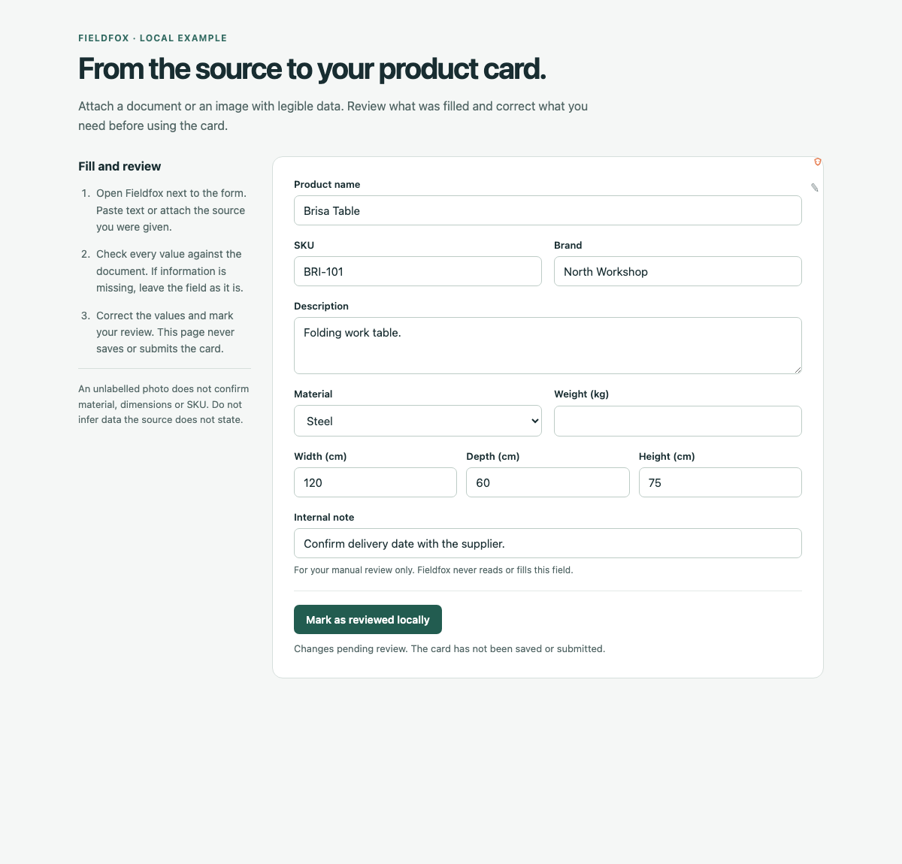
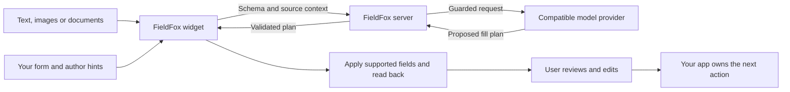

<div align="center">

# 🦊 FieldFox

**From the information you have to the form you need.**

Turn messages, images, and documents into reviewable form fills.<br />
An embeddable web component for the forms you already built.

**MIT licensed · Framework agnostic · Zero runtime dependencies in the widget**

[Try locally](#try-it-locally) · [Embed](#embed-in-your-app) · [How it works](#how-it-works) · [Self-host](#self-host-with-your-model) · [Contribute](#development--contributing)

</div>

```text
       /\   /\
      /  \_/  \       Have the information? Skip the retyping.
      \  o o  /
       \  v  /        source  -->  FieldFox  -->  your form
        \___/                                   your review
```

Your user has an email, a business card, or a product sheet. Your app has a form. FieldFox connects the two: they provide the source, FieldFox fills supported fields, and they review the result in your existing interface. **FieldFox never submits the form.**

## Less typing. More control.

| | What you can do |
|---|---|
| ✍️ **Paste what you know** | Turn free text into fields: contact details, dates, descriptions, and more. |
| 🖼️ **Bring the source** | Paste or upload images. Enable PDF and text-file attachments with `accept-documents`; extraction depends on your model's capabilities. |
| 🧩 **Keep your form** | Add a custom element beside native controls, React forms, supported ARIA widgets, or ProseMirror/tiptap editors. |
| 🎯 **Guide the fill** | Add field hints and examples, exclude fields with `data-ff-ignore`, and tune annotations in development with adjustment mode. |
| 👀 **Keep the human in charge** | Review and edit the values in place. The widget reports its result; your app owns what happens next. |
| 🏠 **Run it on your terms** | Self-host the MIT widget and server with your own compatible model provider. Cloud uses the same fill engine. |

**A concrete example:** open a product card, attach a supplier's labelled specification sheet, and fill the stated name, SKU, material, and dimensions. Review the values against the source and add your internal note manually. The [product-card example](examples/plain-html/products.html) includes a field excluded from FieldFox and a local review action.



*Actual local UI after a deterministic mock-provider fill. This shows the workflow, not model extraction accuracy.*

## Availability

**FieldFox is pre-launch software.** The open-source packages and local examples are available; the complete cloud onboarding and payment journey is still being prepared.

| Path | Status | What it means for you |
|---|---|---|
| **FieldFox Cloud** | Pre-launch | The intended default: copy one snippet, get a free first fill before signup, then add capacity when needed. The public zero-config snippet is not ready for adoption yet. |
| **Self-hosted** | Available for evaluation | Run the widget and server with your own provider credentials. No FieldFox account or FieldFox usage metering; your provider and infrastructure costs still apply. |
| **Local preview** | Available without credentials | Explore the real widget/server flow with a deterministic mock provider. No model account required. |

<details>
<summary><strong>Release and cloud status — checked September 18, 2026</strong></summary>

- Published packages: widget **0.3.0**, server **0.5.0**, shared **0.2.0**.
- This checkout contains widget **0.3.1**, including a fix for script loading on host pages without a UTF-8 charset declaration. Publication is pending.
- An anonymous hosted API has been deployed. That does **not** mean the default snippet or complete cloud product is launch-ready: the widget's default endpoint still points to a placeholder hostname.
- Accounts, email-code login, usage, and dashboard code have landed in the separate cloud repository. Deployment of that integrated version, provider spend controls, payments, and the public launch remain separate gates.

Use an explicit endpoint for self-hosted evaluation. Do not copy an endpoint-free snippet into production expecting a launched cloud service.

</details>

## Try it locally

Use **Node.js 22.13+** and the repository's pinned **pnpm 11.5.1**. The pinned package manager needs the newer Node version even though some package manifests still declare Node 20.

```sh
git clone https://github.com/Valaris-Studio/fieldfox.git
cd fieldfox
pnpm install --frozen-lockfile
FIELDFOX_E2E_SERVER_PORT=8787 node scripts/e2e-env.mjs
```

Open [the local product-card demo](http://localhost:8080/examples/plain-html/products.html), click the fox beside the form, enter some sample context, and choose **Fill form**. Review the populated fields and try editing them yourself.

> **This preview uses canned values.** It demonstrates the interaction, request path, and field application. It does not extract your text or attachments with a real model and is not evidence of extraction accuracy. Use the provider setup below to evaluate your own material.

The same harness serves [a basic HTML form](http://localhost:8080/examples/plain-html/) and [a React example](http://localhost:5173). Keep ports `8080`, `5173`, `8787`, `8793`, and `8795` free. The explicit `8787` override connects the example pages to the mock-backed API. Stop the harness before running browser tests, which start their own stack.

## Embed in your app

For a bundled frontend, install the published widget:

```sh
npm install @fieldfox/widget@0.3.0
```

```js
import '@fieldfox/widget'; // registers <field-fox>
```

Point it at your form and your server:

```html
<form id="contact-form">
  <label for="name">Name</label>
  <input id="name" name="name" />

  <label for="email">Email</label>
  <input id="email" name="email" type="email" />

  <label for="internal-note">Internal note</label>
  <textarea id="internal-note" data-ff-ignore></textarea>
</form>

<field-fox
  target="#contact-form"
  endpoint="/api/fill"
  site-key="ffx_pk_YOUR_SITE_KEY"
  accept-documents
></field-fox>
```

`/api/fill` must reach your FieldFox server; replace the public site-key placeholder with one configured there. Model credentials stay on the server. Remove `accept-documents` if you only want text and images.

For a plain HTML page, the local build exposes `packages/widget/dist/fieldfox.js`. For a production CDN embed, pin an exact published version and its matching SRI hash. `node scripts/gen-snippet.mjs` generates that pair from CDN bytes and refuses a mismatched local build. **On this checkout it cannot generate a 0.3.1 snippet until that version is published.** See the [embedding reference](docs/EMBEDDING.md) for attributes, events, styling, and framework integration.

## How it works



The widget reads the form structure and sends it with the supplied context to the server. The server applies configured guardrails, separates site-author guidance from user content, requests structured output, and validates the returned plan. The widget applies supported writes and checks them by reading the field back.

**Readback checks that a write took effect; it does not prove the model extracted the right fact.** Users should compare the result with the source. A skipped field stays as it was. A failed confirmation triggers a restore attempt for that field. Cancellation can leave previously confirmed fields filled; this is not an all-or-nothing transaction.

### Forms it understands

| Control | Support |
|---|---|
| Native text, email, date, number, textarea, select, checkbox, radio | Supported controls are filled directly. |
| React controlled inputs | Native setters and input/change events; covered by React 19 fixtures. |
| ARIA selects, comboboxes, switches | Supported accessibility patterns are filled through their roles and accessible names. Your component's behavior still matters. |
| Rich-text editors | ProseMirror-based editors, including tiptap. |
| Unsupported custom controls, Slate/Lexical, generic contenteditable | Left unwritten. |

Matching an option tolerates case, accents, and whitespace differences. It does not treat “Gold” as “Gold Plus.” See the [coverage guide](docs/COVERAGE.md) for the fixture matrix and limits of the measurements.

## Self-host with your model

After installing the repo, stop the mock harness and configure a compatible provider:

```sh
export FIELDFOX_LLM_BASE_URL="https://YOUR_PROVIDER/v1"
export FIELDFOX_LLM_API_KEY="YOUR_SERVER_SIDE_KEY"
export FIELDFOX_LLM_MODEL="YOUR_MODEL_ID"
export FIELDFOX_SITE_KEYS='{"ffx_pk_dev0000000000000000000000000000":{"origins":["http://localhost:8080","http://localhost:5173"],"dailyTokenBudget":1000000}}'

pnpm dev
```

Use a provider exposing compatible chat-completions and structured-output behavior; image and PDF support depend on the selected model. The harness builds the widget and starts the API on `8787`, HTML examples on `8080`, and React on `5173`.

For deployment, configuration, version compatibility, and operational limits, read [Self-hosting](docs/SELF-HOSTING.md). The [server package reference](packages/server/README.md) covers composing `createApp()` into your own service.

### Data and trust

- **Your source is sent for processing.** Form schema, included field context, and supplied text/attachments travel to your configured server and model provider. Self-hosting does not make a remote provider local.
- **Exclude fields deliberately.** `data-ff-ignore` excludes a field or subtree from introspection and filling. Audit the outgoing schema before integrating sensitive forms.
- **Keys have different jobs.** A site key is a public identifier. The provider API key is a server secret. Origin checks, rate limits, and budgets constrain use; Origin alone is not authentication.
- **Review remains essential.** Models can make mistakes. FieldFox validates the plan and checks writes, while your application retains its own validation and submission flow.

See [SECURITY.md](SECURITY.md) for the security model and private vulnerability reporting.

## Development & contributing

```text
fieldfox/
  packages/widget/    <field-fox>, introspection, controls, fill UI
  packages/server/    Hono API, provider calls, plan validation
  packages/shared/    Versioned wire schemas and types
  examples/          Plain HTML and React integration fixtures
  e2e/               Browser flows with a mock model provider
```

```sh
pnpm verify                 # build, configured lint scripts, unit tests, size gate
pnpm exec playwright install
pnpm test:e2e               # browser acceptance flows
pnpm test:simulation        # interrupted provider response and retry
```

Tests use a mock at the provider boundary; no provider credentials are needed. The widget has a **35 KB gzip eager-bundle budget** and imports shared types without bundling the schema runtime. Gates run locally; this project does not depend on hosted CI.

Read [CONTRIBUTING.md](CONTRIBUTING.md) before changing code. Releases use Changesets and `pnpm release`; rehearse with `pnpm release:dry`. The release script validates packed dependencies and installs the tarball before publication. The cloud service composes the published OSS server from a separate repository.

## Explore further

| Guide | Start here when you want to… |
|---|---|
| [Embedding](docs/EMBEDDING.md) | Integrate, style, annotate, or listen for `fieldfox:result`. |
| [Self-hosting](docs/SELF-HOSTING.md) | Configure and operate your own server. |
| [Cloud behavior](docs/CLOUD.md) | Understand the free allowance and exhaustion path. |
| [Coverage](docs/COVERAGE.md) | Inspect supported form fixtures and how coverage is measured. |
| [Architecture](docs/PLAN.md) | Understand the original design and technical decisions. |
| [Roadmap background](docs/ROADMAP.md) | Read the delivery model and historical phase plan. |

Current project status, milestones, session handoffs, and decisions are maintained in Backplane. Public integration contracts and runnable examples live in this repository.

---

Built by **[Valaris Studio](https://valaris.studio)**. Licensed under [MIT](LICENSE).
